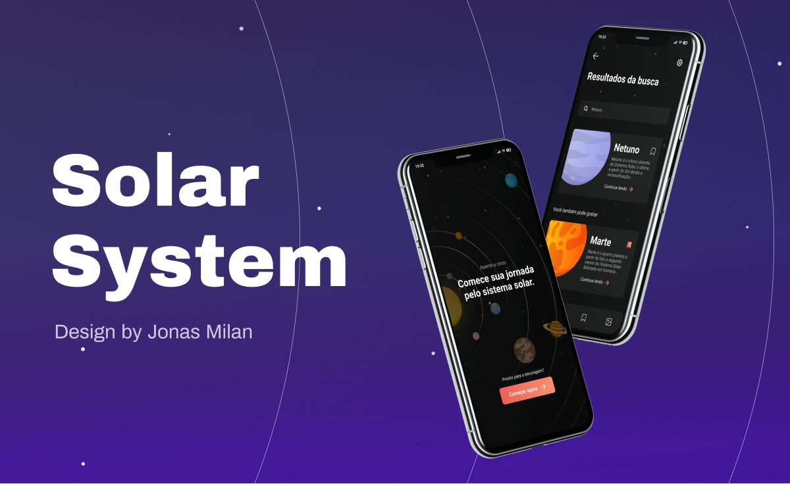

<h1 align="center">Solar System</h1>



### 💻 Projeto Solar System - Umpontoseis

Este é um projeto da umpontoseis criado de designers para desenvolvedores, que traz com ele o intuito de aperfeiçoar nossas habilidade e estreitar os laços profissional.

Items do desafio
- [x] Tela Bem-vindo
- [x] Extra - Tela de Identificação
- [x] Tela Home (Campo de pesquisa, Categorias e Listagem do Planetas)
- [x] Tela Buscar (Campo de pesquisa, Cards dos Planetas)
- [x] Tela Buscar Detalhes (Dados dos planetas)

### 🧪 Tecnologias
 * Expo
 * React Native
 * Typescript
 * Styled-components

## 👨‍🔬 Visualizar projeto

Para visualizar o projeto baixe o aplicativo Expo Go na Play Store e escaneie o código abaixo

## 🚀 Instalando Solar System

Para instalar o Solar Sysmte, siga estas etapas:

Clone o projeto e acesse a pasta

```
git clone https://github.com/Dougllas92/Mobile.git
cd Mobile/SolarSystem
```

Instale as dependências
```
yarn install ou npm install
```

Inicie a aplicação
```
expo start
```

**Server**

Instale o JSON Server globalmente na sua máquina

```
npm install -g json-server
```

Inicie o servidor
```
json-server ./src/services/server.json --host 192.168.1.1 --port 9000
```

⚠️ *Lembre-se de utilizar o endereço IP da sua máquina* ⚠️


## ☕ Usando Solar System

**Alterando o IP do App**

* Abre a pasta SolarSystem no editor e acesse o arquivo `src/services/api.tsx`

* Em baseURL coloque o IP:PORT que colocou no Server.