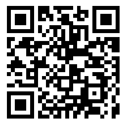

<h1 align="center">Solar System</h1>


### 💻 Projeto Solar System - Umpontoseis

Este é um projeto da umpontoseis criado de designers para desenvolvedores, que traz com ele o intuito de aperfeiçoar nossas habilidade e estreitar os laços profissional.

Items do desafio
- [x] Tela Bem-vindo
- [x] Extra - Tela de Identificação
- [x] Tela Home (Campo de pesquisa, Categorias e Listagem do Planetas)
- [x] Tela Buscar (Campo de pesquisa, Cards dos Planetas)
- [x] Tela Buscar Detalhes (Dados dos planetas)

### 🧪 Tecnologias
 * Expo
 * React Native
 * Typescript
 * Styled-components

## 👨‍🔬 Visualizar projeto

Para visualizar o projeto baixe o aplicativo Expo Go na Play Store e escaneie o código abaixo
<h1>
    
</h1>

## 🚀 Instalando Solar System

Para instalar o Solar System, siga estas etapas:

Baixar o projeto no link abaixo
*O link abaixo faz download apenas deste projeto, enquanto o clone ira fazer download de todos.*
https://drive.google.com/drive/folders/1n4A_G2BWYhKf54U58z-i6JapHNvWdtyW

Clone o projeto e acesse a pasta

```
git clone https://github.com/Dougllas92/Mobile.git
cd Mobile/SolarSystem
```

Instale as dependências
```
yarn install ou npm install
```

Inicie a aplicação
```
expo start
```